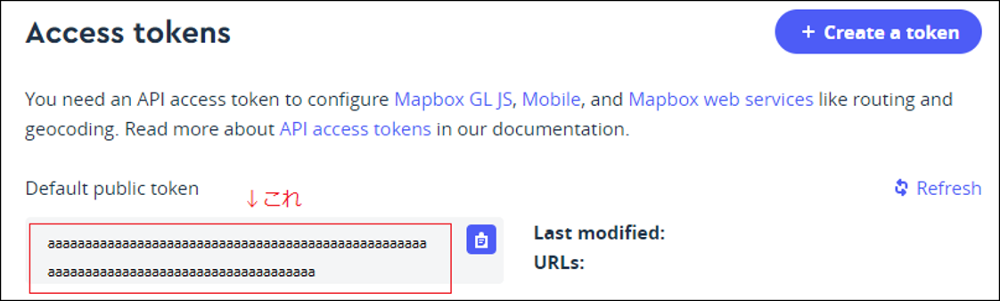

# 3.MAPBOX ACCESS TOKENの取得

Synerex Harmoware-Viz Client では、地図サービス「MAPBOX」を使用している。使用に先立ち事前にMAPBOX ACCESS TOKENを取得する必要がある。

以下URLにアクセスしMAPBOX ACCESS TOKENを取得する。アカウントが無い場合は作成する必要がある。

https://www.mapbox.com/

ログイン後アカウント情報画面からMAPBOX ACCESS TOKENを確認できる。（下図参照）

