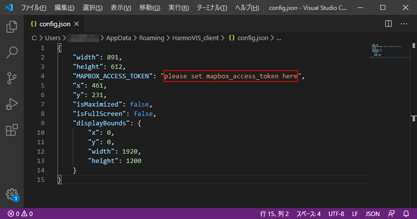

# 5.config設定

Synerex Harmoware-VIS Clientが起動していない状態で、以下configファイル（config.json）をエディタで開き、MAPBOX ACCESS TOKENを設定する。

※Synerex Harmoware-VIS Clientが起動している状態では、configファイルの変更が反映されない場合がある。

## Windowsの場合

 %USERPROFILE%\AppData\Roaming\HarmoVIS_client\config.json

※ USERPROFILEの内容は、コマンドプロンプトにて「> echo %USERPROFILE%」 で確認できる。

## macの場合

$HOME/Library/Application Support/HarmoVIS_client/config.json

## 設定内容

下図 赤枠部分にMAPBOX ACCESS TOKENを設定し、保存する。

※編集するエディタによっては下図のように階層表示しないものもあるので適宜設定する。

