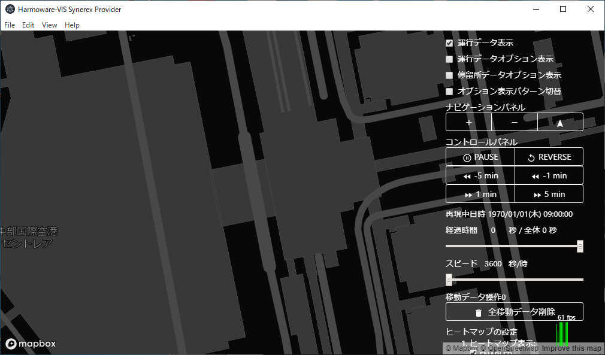
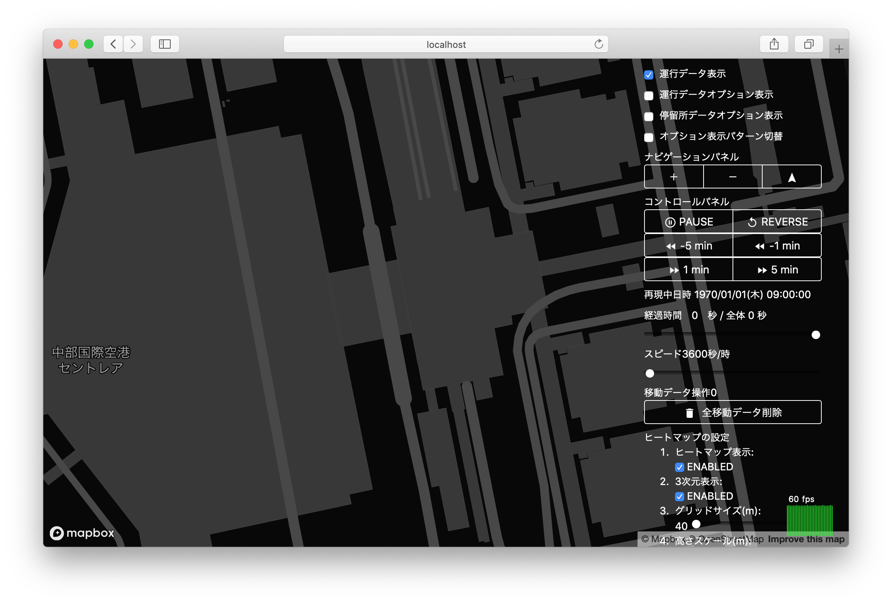
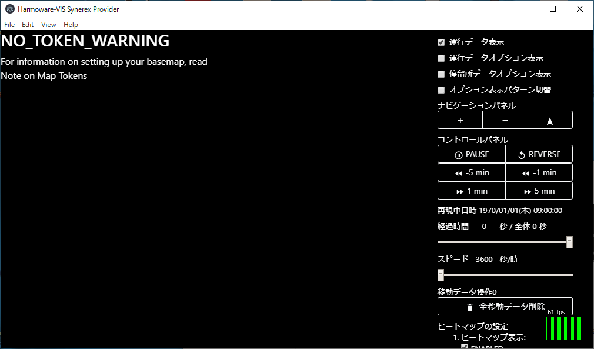

# 7.Harmoware-VIS表示確認

以下いずれかの手順で、Harmoware-VISを正しく表示することを確認する。

## MapWinボタンによる表示

Synerex Harmoware-VIS Clientの「MapWin」ボタン押下により、Harmoware-VISが正しく表示されることを確認する。

## ブラウザによる表示

ブラウザを起動し以下URLにアクセスし、Harmoware-VISが正しく表示されることを確認する。

http://localhost:10080/

## エラー表示

MAPBOX ACCESS TOKENの取込みが失敗した場合以下のメッセージを表示する。

Synerex Harmoware-VIS Clientを終了し、「5.config設定」より手順を確認する。

